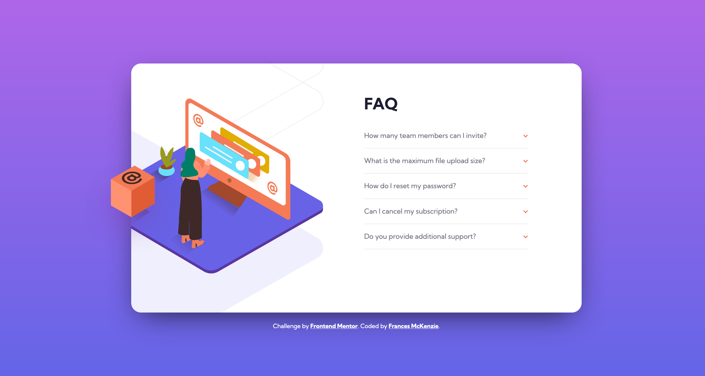

# Frontend Mentor - FAQ accordion card solution

This is a solution to the [FAQ accordion card challenge on Frontend Mentor](https://www.frontendmentor.io/challenges/faq-accordion-card-XlyjD0Oam). Frontend Mentor challenges help you improve your coding skills by building realistic projects.

## Table of contents

- [Overview](#overview)
  - [The challenge](#the-challenge)
  - [Screenshot](#screenshot)
  - [Links](#links)
- [My process](#my-process)
  - [Built with](#built-with)
  - [What I learned](#what-i-learned)

## Overview

### The challenge

Users should be able to:

- View the optimal layout for the component depending on their device's screen size
- See hover states for all interactive elements on the page
- Hide/Show the answer to a question when the question is clicked

### Screenshot

### Links

- [Solution Code](https://github.com/frances-m/faq-accordion-card)
- [Live Site](https://frances-m.github.io/faq-accordion-card)

## My process

### Built with

- Semantic HTML5 markup
- CSS Flexbox
- Sass
- jQuery
- Mobile-first workflow

### What I learned

This was a great challenge to practice with the CSS `position` property and had me coming up with new ideas. This was also my first time using jQuery in a project and it really reinforced how useful it can be. 
